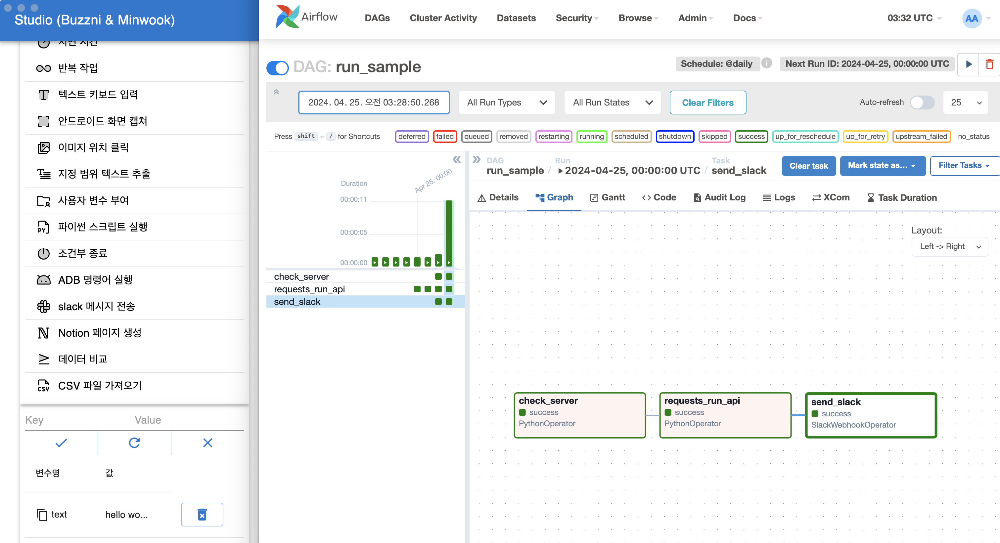

# Open API - Core

이 프로젝트의 API는 스튜디오로 작성한 시나리오를 언제나 제어할 수 있도록 코어 라우터를 제공합니다.

Core API를 사용하면, 사용자는 스튜디오에서 설계한 시나리오를 실행, 삭제, 갱신하는 작업으로 스케줄링할 수 있습니다.

## Airflow 예시



Airflow와 같은 도구를 사용하면, 이 프로젝트의 Core API 호출만으로 바로 시나리오를 반복 및 규칙적으로 실행하는 것이 가능합니다.

```python
def requests_run_api(host="localhost"):
    response = requests.get(f"http://{host}:80/run")
    logger.info(response.json())
    return response.json()
```

간단한 requests.get 코드로 이루어진 파이썬 함수로 Airflow의 Python Operator를 사용하여 DAG의 작업으로 진행할 수 있습니다.

```python
with DAG(
    dag_id="run_sample",
    schedule_interval='@daily',
    default_args=default_args,
    catchup=False,
    max_active_runs=1,
    start_date=datetime(2024, 1, 1),
    end_date=datetime(2025, 1, 1),
    concurrency=1
) as new_dag:
    run = PythonOperator(
        task_id="requests_run_api",
        python_callable=requests_run_api
    )
    run
```

Python Operator로 호출할 API 서버가 정상적인지 확인해보고, run 라우터를 호출합니다.

마지막으로 사전에 등록한 Airflow 연결 정보에서 수신 웹훅 주소를 받은 Slack Webhook Operator가 작업이 완료되었음을 알립니다.

